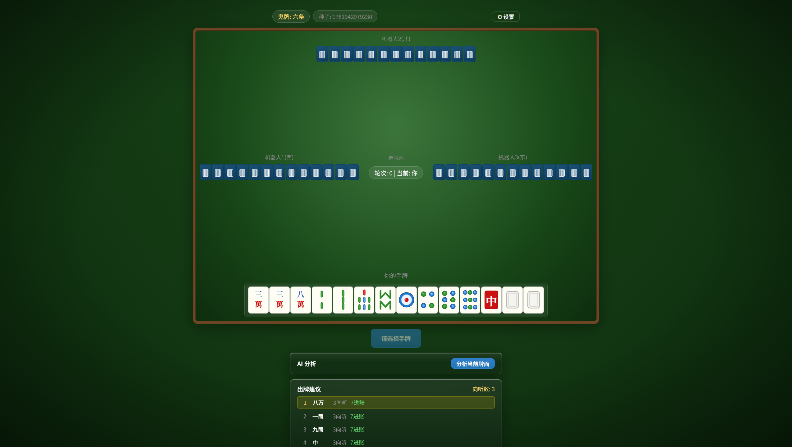
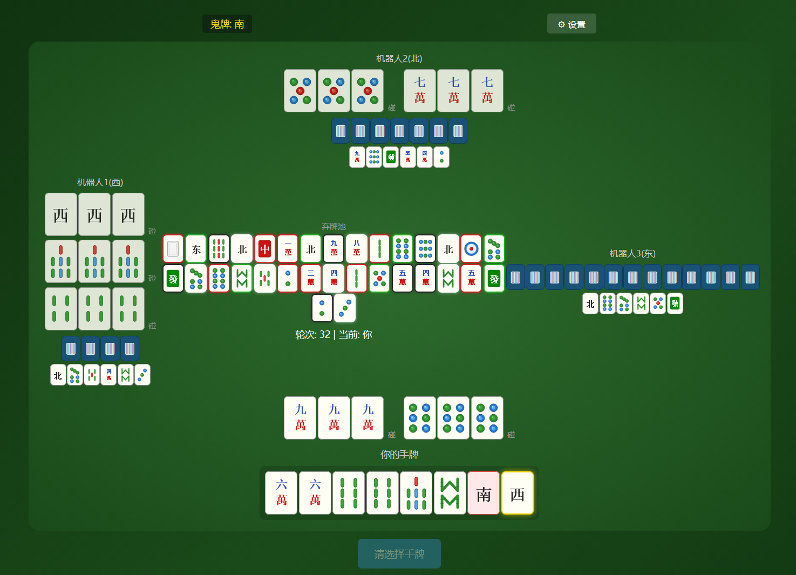
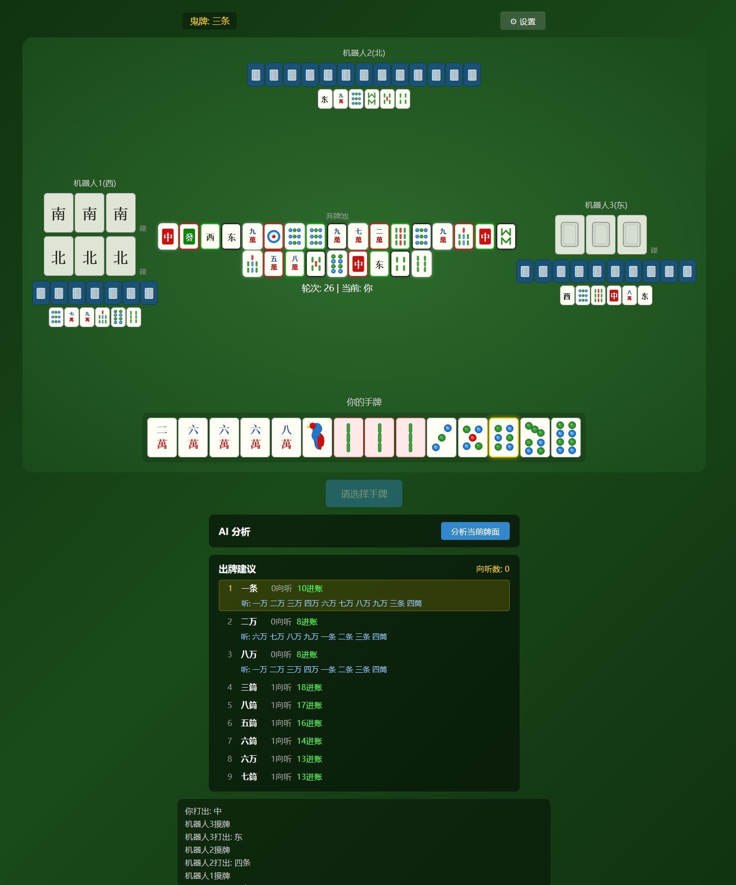
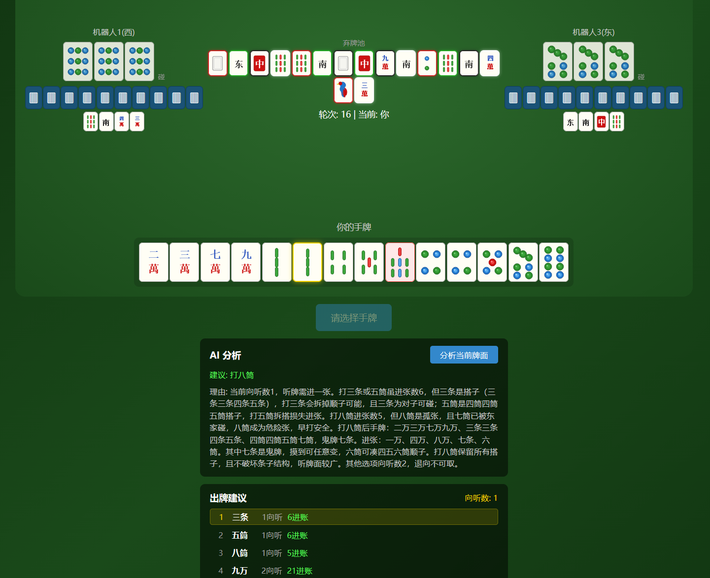
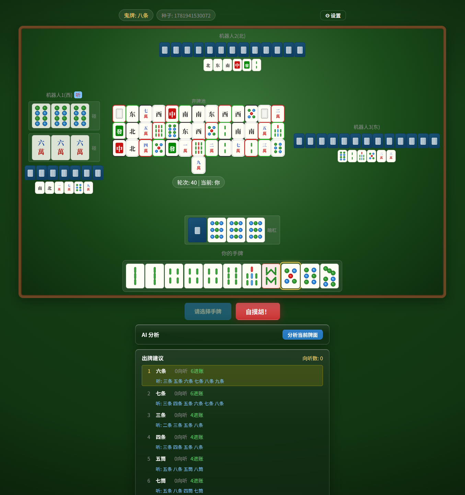
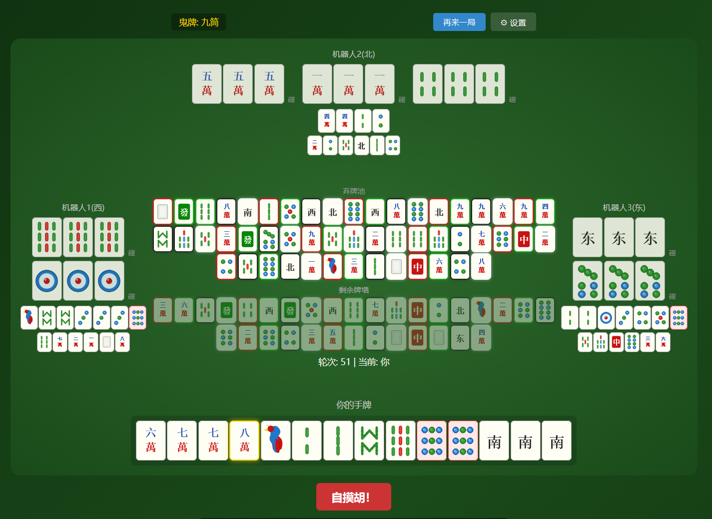

# 广东麻将训练助手

一款基于浏览器的广东推倒胡麻将练习工具，纯前端运行，无需后端服务。支持 AI 牌局分析，帮助你在实战中提升牌技。



---

## 项目亮点

### SVG麻将牌面渲染

所有牌面使用 SVG 矢量图形绘制，包括筒子的圆点图案、条子的竹节造型、万字的中文字符，以及风牌和箭牌，视觉效果接近实物牌面。


### 完整的推倒胡规则

- **万字、条子、筒子** + **风牌（东南西北）** + **箭牌（中發白）**，共 136 张牌
- **不可吃牌**，只能碰、杠（明杠 / 暗杠 / 加杠）
- **仅支持自摸胡**，不可胡别人打出的牌
- 支持标准胡（3n+2）和**七小对**
- 随机**鬼牌（万能牌）**机制

### 四方牌桌布局

模拟真实牌桌视角：
- 底部：你的手牌与操作区
- 上方与左右：三个机器人对手
- 中央：按出牌顺序排列的弃牌池，每张弃牌标注方位颜色，一目了然
  - 东：属木，绿色
  - 南：属火，红色
  - 西：属金，白色
  - 北：属水，黑色




### 算法 + AI 组合分析

本地麻将算法与大语言模型协同工作，各取所长：

- **算法负责计算**：向听数、进张枚举、牌效排序——精确的数学运算，即使多张鬼牌也能给出可靠结果
- **AI 负责决策**：结合牌池、场况、对手行为等上下文，提供有深度的策略建议

多鬼牌情况下的算法推荐：



当简单算法不足以洞察局势时，AI分析助力选出最优解：



### 轻松上手

- 点击「开始新游戏」即可开局
- 点击手牌选中，再点击「出牌」
- 碰、杠、胡等操作按钮会在可操作时自动出现
- 无时间限制，尽情思考
- 胡牌或流局后可点击「查看详情」揭示所有玩家手牌与剩余牌墙



查看对局详情：



---

## 快速开始

> 面向本地使用者，需要基本的命令行操作。

1. 确保已安装 [Node.js](https://nodejs.org/)（18 版本以上）
2. 克隆项目并安装依赖：

```bash
git clone https://github.com/Bertramoon/Guangdong-Mahjong-Training-Assistant.git
cd guangdong_mahjong
npm install
```

3. 启动开发服务器：

```bash
npm run dev
```

4. 浏览器打开终端中显示的地址（通常为 `http://localhost:5173`）

### 配置 AI 分析（可选）

进入游戏后点击右上角齿轮图标，填入：
- **API 地址**：你的 AI 服务端点
- **API Key**：对应的密钥
- **模型名称**：如 `deepseek-v4-pro` 、`mimo-v2-flash`、`minimax-m2.7`等

配置保存在浏览器本地，不会上传到任何服务器。

---

## 技术栈

- Vue 3 + TypeScript + Vite
- 纯前端 SPA，无后端依赖
- SVG 矢量牌面渲染

---

## 未来开发计划

- [ ] **引入麻将算法，提升 AI 分析准确率。**
  当前 AI 分析是将原始牌面数据直接交给大语言模型进行推理，模型需要自行完成向听数计算、牌效分析等数学工作，容易出错。计划在本地先通过麻将算法（向听数、有效进张、牌效排序等）计算出确定性结果，再将这些结构化数据一并发送给 AI，让 AI 专注于策略决策而非数值计算，从而显著提高分析建议的正确率。

- [ ] **多套机器人决策算法，支持不同难度。**
  开发从「入门」到「高手」的多档位 AI 策略，用户可根据自身水平选择合适的对手难度。低难度机器人保留随机性帮助新手熟悉规则，高难度机器人则具备完整的牌效计算与防守意识。

- [ ] **对局记录与持久化数据。**
  将每局对战的详细过程（出牌顺序、碰杠操作、胡牌牌型等）保存到本地存储，支持回顾历史对局。

- [ ] **基于历史数据的 AI 技术指导。**
  利用积累的对局记录，结合大语言模型分析用户的打牌习惯与常见失误，给出针对性的技术提升建议，例如「你在中盘阶段拆搭效率偏低」「面对高危牌时的防守意识不足」等个性化反馈。

