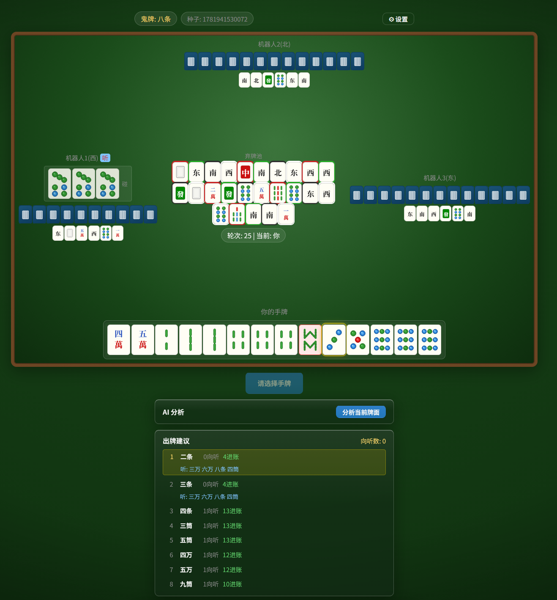
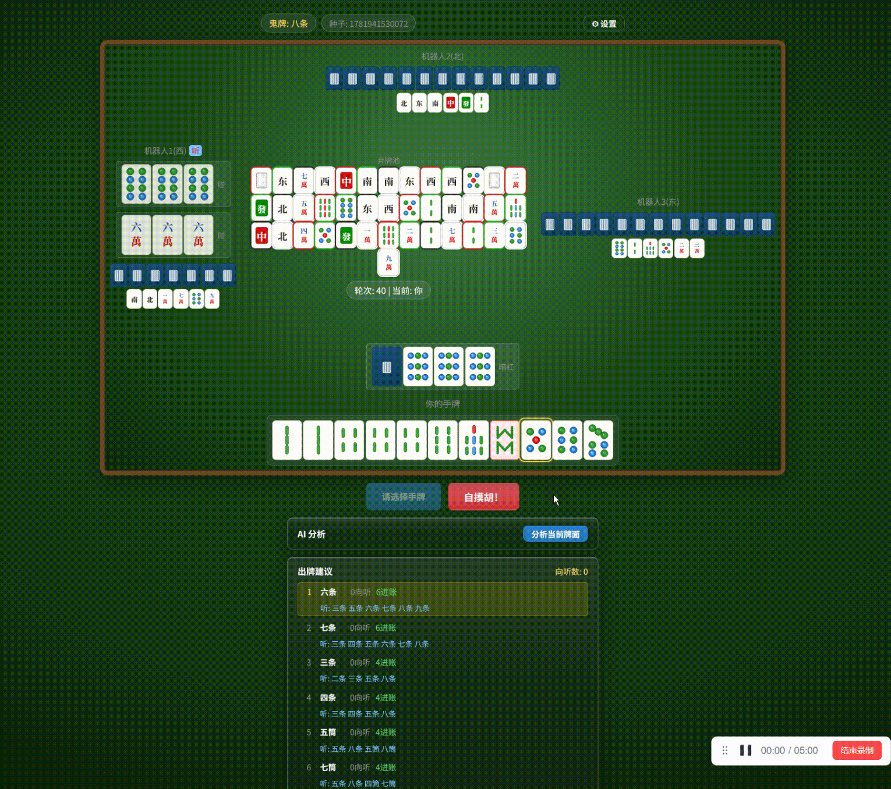
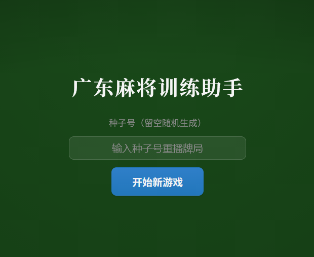
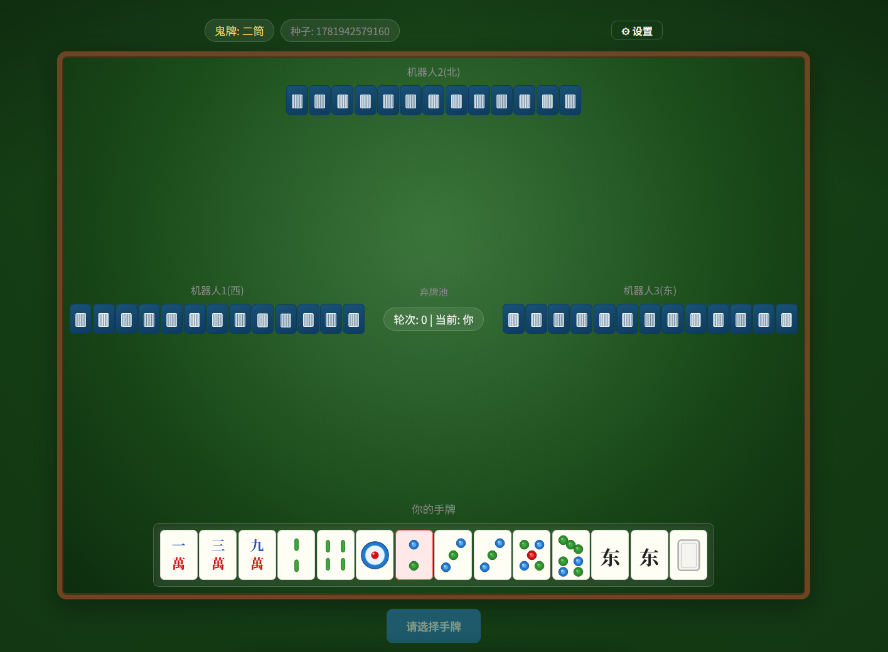
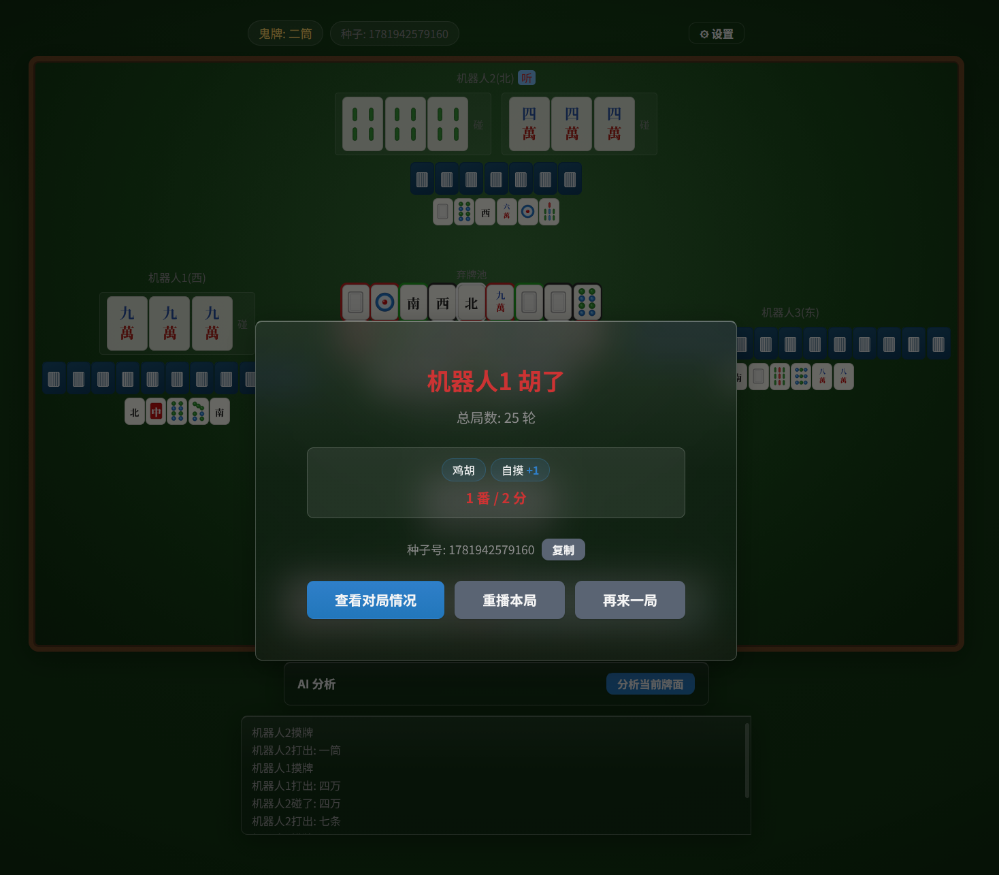
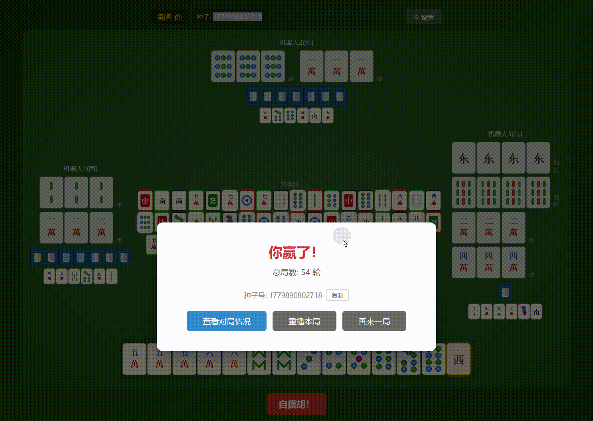
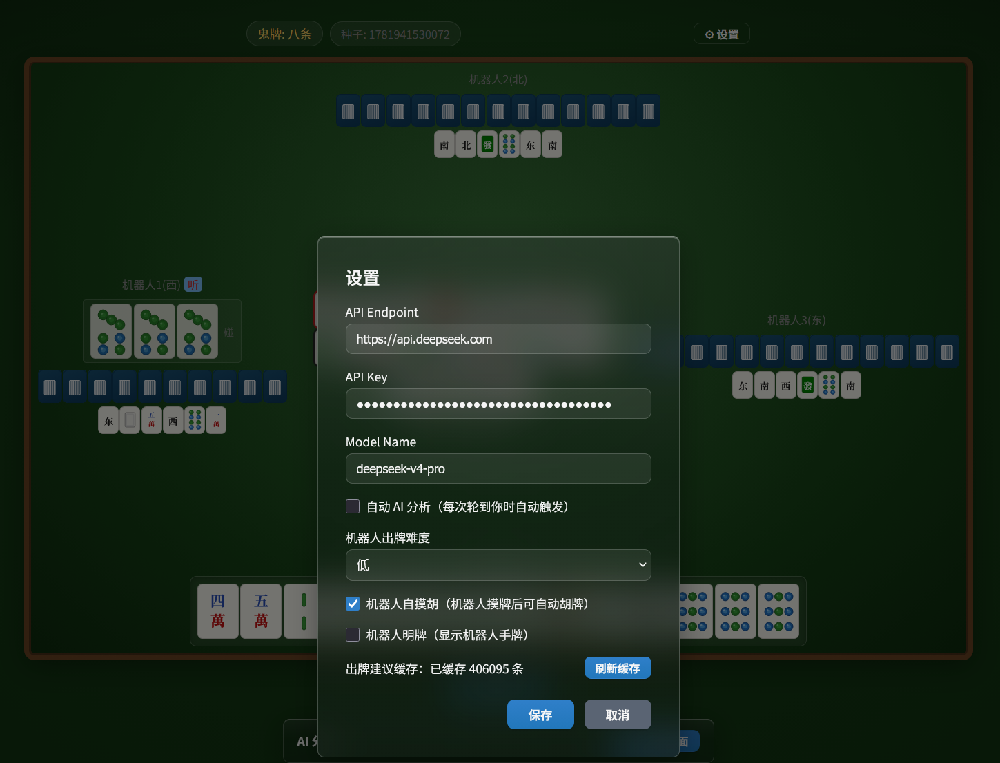
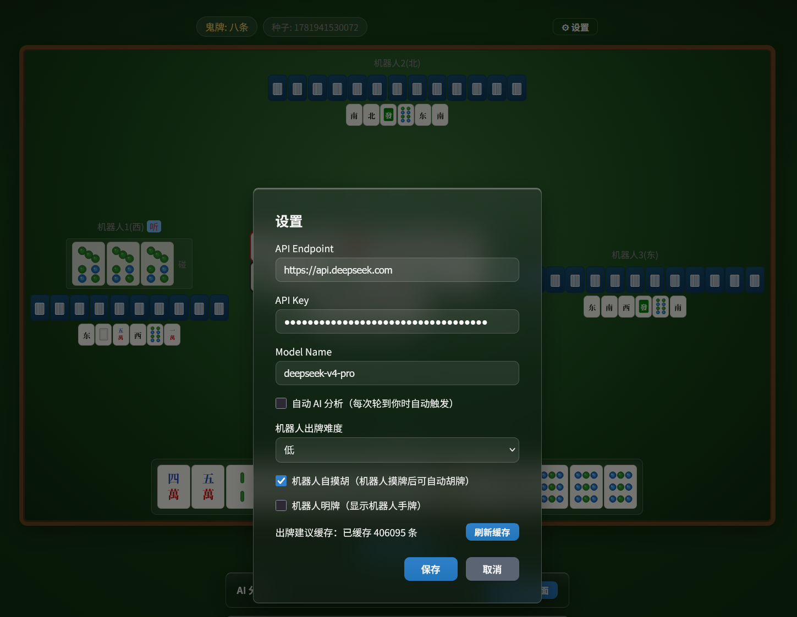

# 广东麻将训练助手

一款基于浏览器的广东推倒胡麻将练习工具，纯前端运行，无需后端服务。支持 AI 牌局分析，帮助你在实战中提升牌技。


---

## 项目特点

### SVG麻将牌面渲染

所有牌面使用 SVG 矢量图形绘制，包括筒子的圆点图案、条子的竹节造型、万字的中文字符，以及风牌和箭牌，视觉效果接近实物牌面。


### 完整的推倒胡规则

- **万字、条子、筒子** + **风牌（东南西北）** + **箭牌（中發白）**，共 136 张牌
- **不可吃牌**，只能碰、杠（明杠 / 暗杠 / 加杠）
- **仅支持自摸胡**，不可胡别人打出的牌
- 支持标准胡（3n+2）和**七小对**
- 随机**鬼牌（万能牌）**机制

### 现代化风格的四方牌桌布局

- 模拟真实牌桌视角

  - 底部：你的手牌与操作区

  - 上方与左右：三个机器人对手

  - 中央：按出牌顺序排列的弃牌池，每张弃牌标注方位颜色，一目了然
    - 东：属木，绿色
    - 南：属火，红色
    - 西：属金，白色
    - 北：属水，黑色


- 整体视觉经过现代化风格重构，追求接近实物牌桌的质感
- 机器人听牌时，名字旁显示「听」标记



### 轻松上手

- 点击「开始新游戏」即可开局
- 点击手牌选中，再点击「出牌」（也支持键盘选择和出牌）
- 碰、杠、胡等操作按钮会在可操作时自动出现
- 无时间限制，尽情思考
- 胡牌或流局后可点击「查看详情」揭示所有玩家手牌与剩余牌墙



### 算法 + AI 组合分析

本地麻将算法与大语言模型协同工作，各取所长：

- **算法负责计算**：向听数、进张枚举、牌效排序——精确的数学运算，即使多张鬼牌也能给出可靠结果
- **AI 负责决策**：结合牌池、场况、对手行为等上下文，提供有深度的策略建议

多鬼牌情况下的算法推荐：


当简单算法不足以洞察局势时，AI分析助力选出最优解：


### 种子化对局回放

每局对局自动生成唯一种子号，固定牌墙顺序。输入种子号即可精确复现同一局牌，特别适合流局后的复盘推演。

- 输入种子号开局，复现**完全相同的牌序**
- 对局结束后可一键复制种子号**分享给好友**

1. 如下图所示，开局时可以指定对局种子。若不指定，则会生成一个随机种子



2. 局中，可以查看对局种子



3. 游戏结束后，可以选择复制种子、重播本局等操作



4. 通过重播本局或者输入指定种子，可以进行训练，或者将你觉得有意思的对局分享给好友

> 本局种子是1781942579160



### 机器人难度与行为设置

通过右上角齿轮进入设置，可调整机器人行为，自由控制牌局难度：

- **机器人出牌难度**（5 档）：控制机器人"本回合走智能出牌"的概率，越高牌效越接近高手
  - **关闭**：纯启发式策略，适合日常练习（默认）
  - **低 / 中 / 高**：分别以约 20% / 60% / 85% 的概率使用向听数推荐算法出牌，其余回合走启发式
  - **最高**：始终使用推荐算法出牌，牌效拉满
- **自动 AI 分析**：开启后每次轮到你时自动触发 AI 分析，无需手动点击
- **自摸胡**：开启后机器人摸牌若已胡牌则自动胡牌结束对局；关闭时机器人即使胡牌也会继续出牌，适合新手熟悉规则。默认关闭
- **明牌**：开启后游戏过程中可以看到所有机器人的手牌，方便观察对手牌面、学习推算。默认关闭
  

---

## 快速开始

> 面向本地使用者，需要基本的命令行操作。

1. 确保已安装 [Node.js](https://nodejs.org/)（18 版本以上）
2. 克隆项目并安装依赖：

```bash
git clone https://github.com/Bertramoon/Guangdong-Mahjong-Training-Assistant.git
cd guangdong_mahjong
npm install
```

3. 启动开发服务器：

```bash
npm run dev
```

4. 浏览器打开终端中显示的地址（通常为 `http://localhost:5173`）

### 配置 AI 分析（可选）

进入游戏后点击右上角齿轮图标，填入：
- **API 地址**：你的 AI 服务端点
- **API Key**：对应的密钥
- **模型名称**：如 `deepseek-v4-pro` 、`mimo-v2-flash`、`minimax-m2.7`等

配置保存在浏览器本地，不会上传到任何服务器。



---

## 技术栈

- Vue 3 + TypeScript + Vite
- 纯前端 SPA，无后端依赖
- SVG 矢量牌面渲染
- Web Worker：向听数 / 出牌建议 / 反应分析等重计算在独立线程进行，主线程仅兜底，界面不卡顿
- IndexedDB：预计算并持久化约 40 万条向听花色缓存，运行期牌效查询 O(1) 命中

---

## 未来开发计划

- [x] ~~**引入麻将算法，提升 AI 分析准确率。**~~

- [x] ~~**多套机器人决策算法，支持不同难度。**~~
  已实现 5 档出牌难度（关闭 / 低 / 中 / 高 / 最高），按概率在"向听数推荐算法"与"启发式策略"之间混合，配合自摸胡、明牌等设置，可自由调节牌局难度。

- [ ] **对局记录与持久化数据。**
  将每局对战的详细过程（出牌顺序、碰杠操作、胡牌牌型等）保存到本地存储，支持回顾历史对局。

- [ ] **基于历史数据的 AI 技术指导。**
  利用积累的对局记录，结合大语言模型分析用户的打牌习惯与常见失误，给出针对性的技术提升建议，例如「你在中盘阶段拆搭效率偏低」「面对高危牌时的防守意识不足」等个性化反馈。

